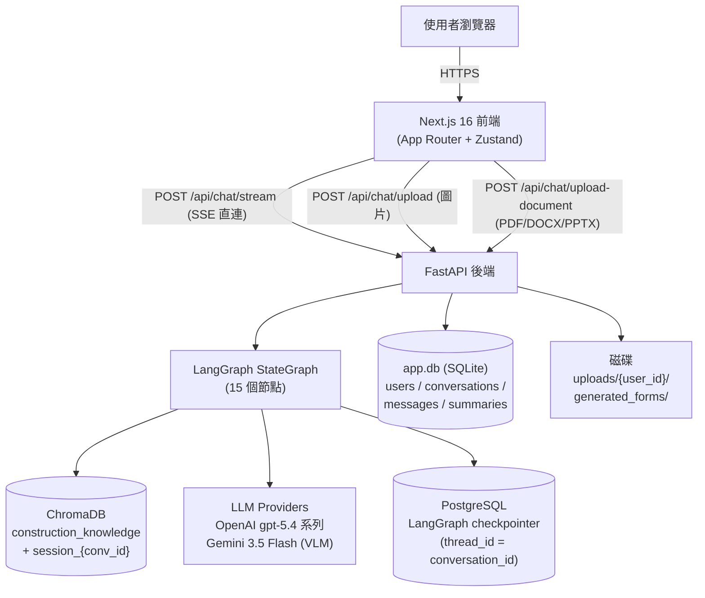
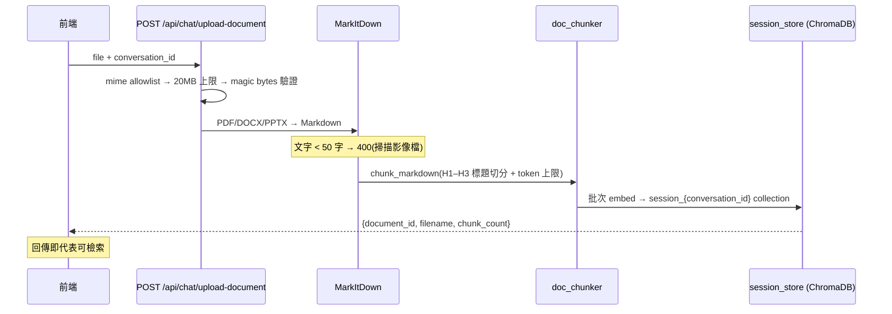
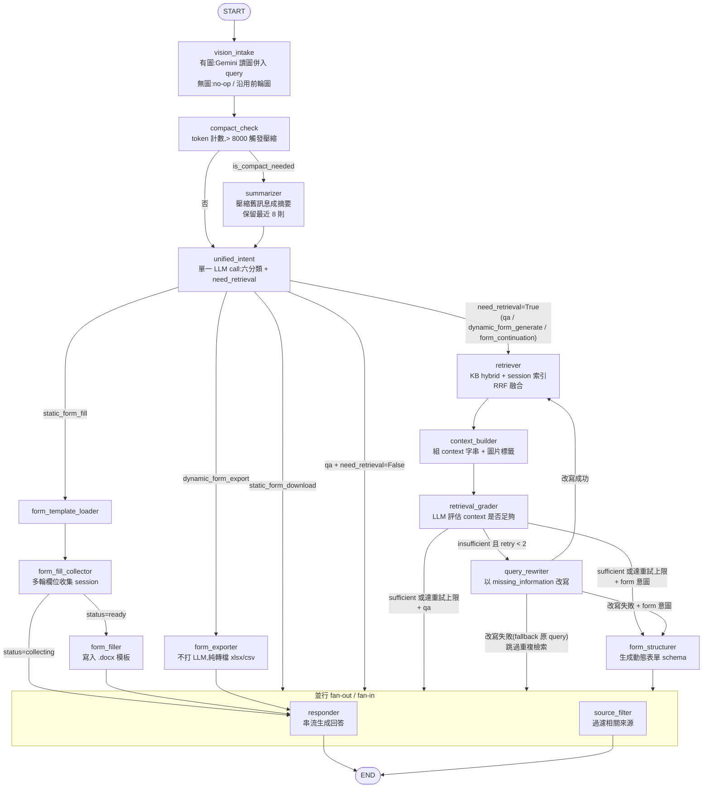
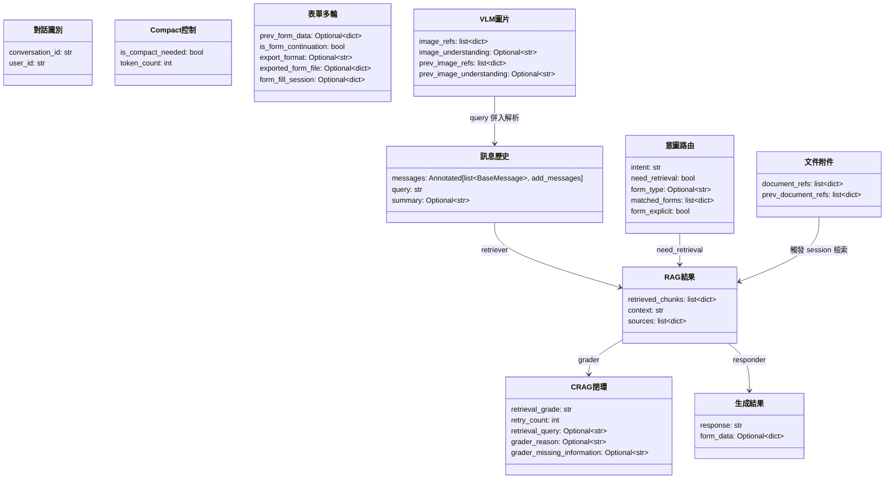
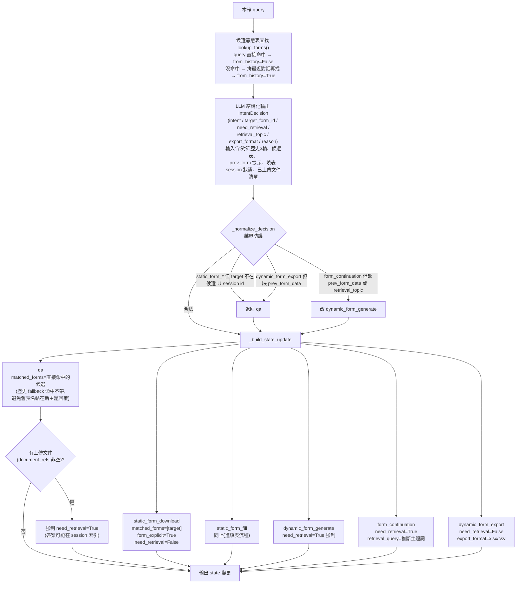
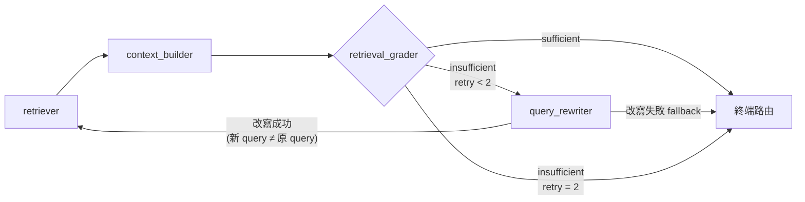
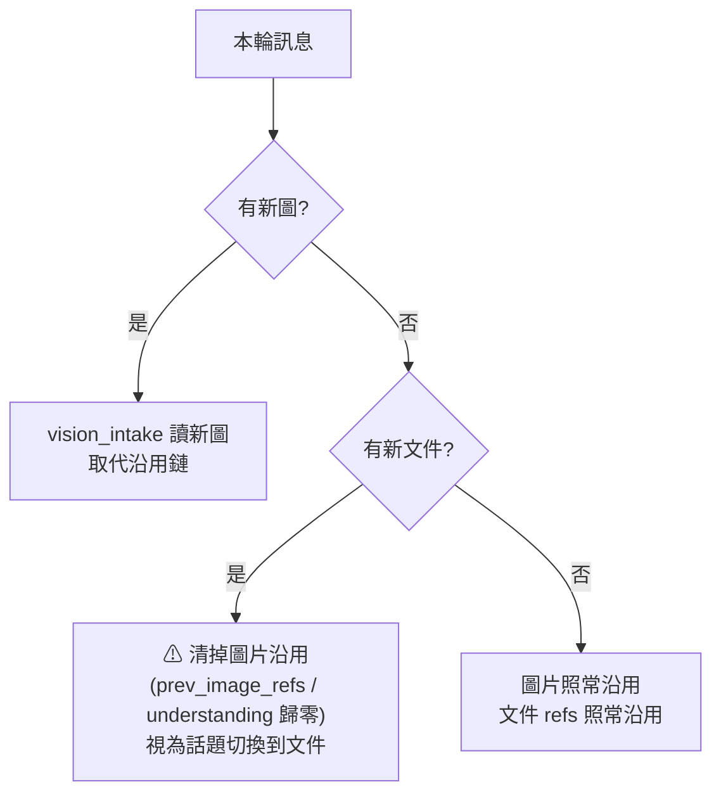

# SYSTEM.md — 系統架構與設計說明

本文件完整說明營造知識助理(RAG 模組)的系統架構、演算法設計、LangGraph 流程、
GraphState 結構與意圖控制流。閱讀對象:要接手開發或想理解設計決策的工程師。

> 部署、維運、SEARCH 模組(鋼筋盤價助理)請看 [README.md](README.md)。

---

## 目錄

1. [系統總覽](#1-系統總覽)
2. [資料層](#2-資料層)
3. [知識庫 Ingestion Pipeline(離線)](#3-知識庫-ingestion-pipeline離線)
4. [聊天文件上傳 Pipeline(線上)](#4-聊天文件上傳-pipeline線上)
5. [檢索演算法設計](#5-檢索演算法設計)
6. [LangGraph 流程全圖](#6-langgraph-流程全圖)
7. [GraphState 完整結構](#7-graphstate-完整結構)
8. [意圖控制流(unified_intent)](#8-意圖控制流unified_intent)
9. [CRAG 閉環](#9-crag-閉環)
10. [多模態附件(圖片 / 文件)](#10-多模態附件圖片--文件)
11. [上下文管理(Compaction)](#11-上下文管理compaction)
12. [並行設計與 SSE 串流](#12-並行設計與-sse-串流)

---

## 1. 系統總覽



核心理念:

- **Graph 只負責「一輪對話」的推理流程**;持久化(訊息、摘要、表單 session)由
  checkpointer 與 app.db 分工。
- **知識庫寫入完全離線**(scripts pipeline),線上 graph 對 KB 只讀。唯一的線上寫入
  是聊天文件上傳的「對話專屬 session 索引」。
- **重資料不進 state**:圖片 base64、文件全文都不進 checkpoint;state 只放輕量參照
  (路徑 / id),需要時從磁碟或 ChromaDB 現讀。

---

## 2. 資料層

| 儲存 | 內容 | 寫入時機 |
|---|---|---|
| `app.db`(SQLite) | users / conversations / messages / conversation_summaries | API 層(save_message 等) |
| PostgreSQL(或 SQLite fallback) | LangGraph checkpoint(每輪 graph state 快照,thread_id = conversation_id) | graph 執行後自動 |
| ChromaDB `construction_knowledge` | 知識庫 chunks(51 份營造規範 Markdown) | 離線 ingestion |
| ChromaDB `session_{conversation_id}` | 聊天上傳文件的 chunks(對話專屬) | 上傳當下 |
| `uploads/{user_id}/` | 上傳的圖片與文件原檔(uuid 命名 + `.name` sidecar 存原始檔名) | 上傳當下 |

生命週期:刪除對話 → 連動清 checkpoint thread、generated_forms、session collection;
每日背景任務清 30 天以上的上傳檔與 session collection。

---

## 3. 知識庫 Ingestion Pipeline(離線)

`backend/scripts/` 七個循序腳本:

```
data_markdown/*.md
  → 01_preprocess.py   清理(圖片路徑正規化、移除 code block)
  → 02_chunk.py        智慧切塊(80–1000 tokens,依文件類型 A/B/C 不同策略)
  → 03_generate_meta.py 產生 metadata
  → 04_review_meta.py  人工審核
  → 05_embed_ingest.py embedding(text-embedding-3-small)→ ChromaDB(支援版本化)
  → 06_verify.py       驗證
  → 07_clean_chunks.py 清孤兒 chunks
```

### 切塊策略(02_chunk.py)

依檔名 / 內容自動判斷文件類型:

| 類型 | 文件 | 策略 |
|---|---|---|
| A | 作業檢核表 | 以 H2 切段,表格列以 20 列為一批 |
| B | 標準作業程序 | 以 H3 切段,段落級子切分,保留上層標題 context |
| C | 掃描 PDF 轉出 | 先清雜訊再 H2/H3 切分 |

Token 限制:MIN=80 / TARGET=500 / MAX=1000(tiktoken cl100k_base)。
切分時避開圖片 Markdown 區塊(`find_safe_split_point`)。

每個 chunk 的 metadata:`source_file`、`section_code`、`parent_h1/h2/h3`、
`document_type`、`tags`、`has_images`、`image_paths` 等 — 供檢索過濾、
context 組裝與來源顯示使用。

---

## 4. 聊天文件上傳 Pipeline(線上)

使用者在聊天中附 PDF / Word / PPT,即問即答。文件**只屬於該對話**,不進全域知識庫。



設計決策:

- **Parser 用 [MarkItDown](https://github.com/microsoft/markitdown)**:單一 API 支援
  三種格式,輸出 Markdown,直接餵給通用 chunker(`backend/app/rag/doc_chunker.py`)。
- **索引在 endpoint 內同步完成**,graph 零新增節點 — retriever 看到
  `document_refs` 非空就多查一路 session 索引(見 §5)。
- **不做 OCR**:掃描型 PDF 抽不出文字 → 回明確 400,引導改走圖片上傳
  (vision_intake 已有 Gemini OCR)。
- 安全:magic bytes 驗證(`%PDF-` / `PK\x03\x04`)、server 端 uuid 檔名、
  hex-id 驗證防 path traversal、檔案只在 `uploads/{user_id}/` 下解析。

---

## 5. 檢索演算法設計

### 5.1 Hybrid Retrieval(單一 query)

`backend/app/rag/retriever.py::retrieve()`:

```
query ─┬─► 向量搜尋 top-20(text-embedding-3-small,query embedding 有 LRU cache)
       └─► BM25 top-20(jieba 分詞 + 4,948 詞營造領域自訂詞典,score>0 才收)
                │
                ▼
          RRF 融合 → 取前 8
```

**RRF(Reciprocal Rank Fusion)**:

```
score(chunk) = Σ_lists  1 / (k + rank + 1),  k = 60
```

同一 chunk 出現在多個清單會累加分數 — 不需要調權重,天然偏好「多路都認可」的結果。
`rrf()` 接受**任意數量**的排序清單(向量 / BM25 / session / 改寫前後),所有融合共用同一實作。

BM25 索引為 process 級 lazy singleton,(index, corpus) 綁成 tuple 原子換置,
admin 觸發 rebuild 不會出現「舊 index 配新 corpus」的錯位。

### 5.2 多路融合(retriever 節點)

`backend/app/graph/nodes/retrieval.py` 依 state 動態決定查幾路:

| 條件 | 檢索路 |
|---|---|
| 基本 | KB hybrid(向量+BM25 RRF) |
| 有上傳文件(`document_refs` 非空) | + session 索引向量搜尋 top-8 |
| 有改寫 query(CRAG 重試) | 上述全部 × 2(原始 query + 改寫 query 各跑一輪) |

所有清單最後丟進同一個 RRF 取前 8。session 搜尋任何錯誤回 `[]`,
絕不讓 KB 檢索陪葬。

### 5.3 來源過濾(source_filter)

與 responder **並行**執行:用 query + chunks 前 120 字讓 LLM 挑出「實質有貢獻」
的 chunk 索引,過濾後才是前端來源面板顯示的內容。用 query 而非 response 評估,
就是為了能並行(不用等 responder 生成完)。

---

## 6. LangGraph 流程全圖



節點一覽(15 個):

| 節點 | LLM | 職責 |
|---|---|---|
| `vision_intake` | Gemini 3.5 Flash | 讀圖 OCR/描述,前 500 字併入 query,全文存 `image_understanding` |
| `compact_check` | — | tiktoken 計數,> 8000 設 `is_compact_needed` |
| `summarizer` | default | 壓縮舊訊息,RemoveMessage 刪除 + 摘要寫 DB |
| `unified_intent` | grader(結構化輸出) | 六分類 + need_retrieval(見 §8) |
| `retriever` | — | 多路檢索 + RRF(見 §5) |
| `context_builder` | — | chunks → context 字串(來源標頭 + 圖片 Markdown) |
| `retrieval_grader` | grader(結構化輸出) | sufficient / insufficient + missing_information |
| `query_rewriter` | grader | 改寫 query(永遠基於原始 query,防語意漂移) |
| `form_structurer` | form | 依 context 生成動態表單 JSON schema |
| `form_template_loader` | — | 載入靜態表單 schema |
| `form_fill_collector` | form | 多輪收集欄位(分組引導 / 批次編輯 / AI 代寫) |
| `form_filler` | — | collected 欄位寫入 .docx 模板 |
| `form_exporter` | — | prev_form_data → .xlsx / .csv |
| `responder` | default(streaming) | 依 intent 選 prompt 生成回答(SSE 逐 token) |
| `source_filter` | grader(結構化輸出) | 過濾相關來源(與 responder 並行) |

---

## 7. GraphState 完整結構

定義於 `backend/app/graph/state.py`(TypedDict,所有節點共享)。



欄位語意速查:

| 群組 | 欄位 | 說明 |
|---|---|---|
| 識別 | `conversation_id` / `user_id` | thread_id = conversation_id,checkpointer 以此分隔 |
| 訊息 | `messages` | `add_messages` reducer:append 自動合併、RemoveMessage 可刪 |
| | `query` | 本輪問題;vision_intake 可能把圖片解析併入(原始問題仍在 messages) |
| | `summary` | 壓縮摘要(同步存 app.db,重啟可恢復) |
| RAG | `retrieved_chunks` | `[{id, document, metadata, distance}]` |
| | `context` | context_builder 組好的字串 |
| | `sources` | 前端來源面板資料(source_filter 會覆寫為過濾後版本) |
| 意圖 | `intent` | 六分類之一(見 §8) |
| | `need_retrieval` | False = 跳過檢索直接回答 |
| | `matched_forms` / `form_explicit` | 靜態表單 registry 匹配結果 / 是否明確索取 |
| CRAG | `retrieval_query` | 改寫後查詢;**原始 query 永不被覆寫**,每輪重置 |
| | `retry_count` | 重試計數,上限 2,每輪重置 |
| | `grader_missing_information` | grader 指出缺什麼 → rewriter 的改寫依據 |
| 表單 | `form_fill_session` | 填表 session(target/collected/status),**跨輪由 checkpointer 持久化** |
| | `prev_form_data` | 最近一輪生成的動態表單(延續生成 / 匯出用) |
| 圖片 | `image_refs` | `[{id, path, mime}]` 輕量參照,base64 不進 state |
| | `prev_image_refs` / `prev_image_understanding` | 多輪沿用「最近一張」直到有新圖或新文件 |
| 文件 | `document_refs` | `[{id, path, filename}]`;非空時 retriever 加查 session 索引 |
| | `prev_document_refs` | 多輪沿用(索引本就持久,refs 供 intent 提示與檢索觸發) |

**每輪重置 vs 跨輪保留**:`chat_stream` 組 `initial_state` 時,CRAG 欄位
(`retrieval_query` / `retry_count` / `grader_*`)強制重置,避免上一輪的改寫
污染本輪;`form_fill_session` / `messages` / `summary` 則靠 checkpointer 跨輪延續;
`prev_*` 系列由 chat_stream 從上一輪 state 讀出後重新注入。

---

## 8. 意圖控制流(unified_intent)

### 8.1 為什麼是單一 LLM call

舊版是「keyword fast-path + LLM」混合,問題:短訊息字面誤判
(「我要規範的**詳細說明**」含「我要」被當成索取表單)、keyword 集合無限膨脹。
現版**每輪都打一次 LLM**(約 300ms),用結構化輸出 + few-shot 把規則教給模型,
再用 code 做越界防護。

### 8.2 六種 intent 與決策流



### 8.3 Graph 路由函式(builder.py)

intent 決定後,走向由五個條件路由函式控制:

| 路由 | 位置 | 邏輯 |
|---|---|---|
| `_route_compact` | compact_check 後 | `is_compact_needed` → summarizer,否則直入 unified_intent |
| `_route_intent` | unified_intent 後 | `static_form_download` → 並行 [responder ∥ source_filter];`static_form_fill` → form_template_loader;`dynamic_form_export` → form_exporter;其餘看 `need_retrieval`:True → retriever,False → 並行回應 |
| `_route_after_collector` | form_fill_collector 後 | session `status=ready` → form_filler(寫檔),否則 responder 追問缺的欄位 |
| `_route_grader` | retrieval_grader 後 | `insufficient` 且 `retry < 2` → query_rewriter;否則 form 意圖 → form_structurer、qa → 並行回應 |
| `_route_rewriter` | query_rewriter 後 | 改寫出新 query(與原 query 字串不同)→ retriever 重檢索;改寫失敗 fallback 原 query → **跳過重複檢索**直接走終端路由(上一輪 chunks 還在 state,重查同 query 只是白燒) |

### 8.4 防護細節

- LLM 給的 `target_form_id` 必須在「本輪候選 ∪ 進行中 session 的表 id」內,否則退 qa
  — 防 LLM 幻覺出不存在的表。
- `static_form_*` 但 target 為 null 且有 active session → 沿用 session 的表 id
  (使用者第二輪說「我想要填入資訊」沒講表名仍能延續)。
- rewriter 輸出有三重 sanity check:空字串 / 命中放棄訊號詞(「無法」「不確定」…)/
  超過 40 字(沒照「4–10 字短語」格式)→ 一律 fallback 原 query。

---

## 9. CRAG 閉環



設計要點:

1. **Grader 評全部 8 筆 chunk、每筆前 400 字** — 早期只評前 5 筆出現
   「grader 說不足但全文其實夠」的假陰性,多燒一輪 rewrite。
2. **Rewriter 永遠基於原始 query 改寫**(不是基於上一次改寫),防多輪重試語意漂移;
   grader 的 `missing_information` 作為改寫上下文。
3. **改寫後的重新檢索是「雙路」**:原始 query 與改寫 query 各跑一輪完整檢索,
   RRF 融合 — 同時出現在兩組的 chunk 自動加分,兩個信號都有貢獻。
4. **改寫失敗不重查**:`_route_rewriter` 的字串比較邏輯刻意與 retriever 的雙路 gate
   一致(`.strip()` 不等式),確保「會進 retriever 的」一定是會做雙路融合的情況。
5. 上限 2 次重試;重試計數每輪對話重置。

---

## 10. 多模態附件(圖片 / 文件)

兩種附件走完全不同的路徑,但共用「多輪沿用」概念:

| | 圖片(VLM) | 文件(PDF/DOCX/PPTX) |
|---|---|---|
| 上傳 endpoint | `/api/chat/upload` | `/api/chat/upload-document` |
| 處理時機 | graph 內(vision_intake 節點) | endpoint 內(graph 零改動) |
| 內容去向 | 解析文字併入 query + 原圖附給 responder | chunks 進 session 向量索引 |
| 影響檢索 | 間接(query 被 enrich) | 直接(retriever 多查一路) |
| 多輪沿用 | `prev_image_refs`,沿用「最近一張」 | `prev_document_refs`,索引本就持久 |

### 沿用規則與衝突處理



**為什麼新文件要清圖片沿用**(實際踩過的 bug):responder 會把沿用的舊圖
**原圖附在本輪訊息上**(多模態 grounding)。使用者上傳文件問「總結此檔案」時,
模型看到的是「總結此檔案 + 一張舊圖」→「此檔案」被理解成圖,文件檢索結果被無視。
新附件 = 注意力切換訊號,故清掉圖片鏈。

反向(先文件後新圖)**刻意不對稱處理**:文件只透過檢索貢獻 context
(會被 grader / source_filter 過濾,不會綁架回答),且「這張圖符合文件規範嗎?」
的跨模態提問是合理需求。

---

## 11. 上下文管理(Compaction)

- `compact_check`(無 LLM):tiktoken cl100k 計算 `messages` 總 token,
  **> 8000** 設 `is_compact_needed`。
- `summarizer`:保留最近 **8 則**(4 輪),其餘交 LLM 摘要;
  用 `RemoveMessage`(add_messages reducer 支援)從 state 刪舊訊息;
  摘要同步 upsert 到 app.db 的 `conversation_summaries`(重啟後 chat_stream
  會從 DB 載回注入 state)。
- responder 的 system prompt 含 `[前情摘要]` 區塊,摘要 + 最近 8 則 = 完整上下文。

---

## 12. 並行設計與 SSE 串流

### 並行 fan-out / fan-in

context 就緒後,`responder` 與 `source_filter` **同時執行**
(LangGraph conditional edge 回傳 list),END 自動等兩者完成:

- responder:串流生成回答(使用者立即看到 token)
- source_filter:評估來源相關性(用 query 評,不依賴 response → 才能並行)

淨效果:來源過濾的延遲完全被生成時間遮蔽。

### SSE 事件協定(`POST /api/chat/stream`)

| 事件 | 內容 | 時機 |
|---|---|---|
| `step` | `{node, label}` | 每個 graph 節點開始(前端顯示進度) |
| `image_reading` | — | vision_intake 開始且本輪有新圖 |
| `form_loading` | — | form_structurer 開始 |
| `text` | `{content}` | responder 逐 token |
| `sources` | `{data: [...]}` | graph 完成後一次性 |
| `form_files` | `{data: [...]}` | 表單下載卡(靜態 / 已填寫 / 匯出檔) |
| `error` / `done` | — | 異常 / 結束 |

其他細節:全域 semaphore 限 20 併發對話;每輪所有 LLM call 的 usage
(intent / grader / rewriter / responder / source_filter / summarizer)累計後
寫進 assistant message 的 token 欄位。
