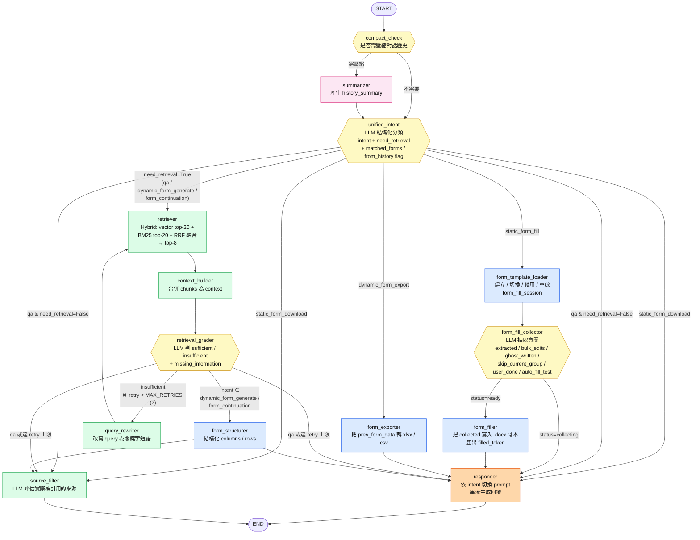

# Agent Flow 設計文件

> 後端 LangGraph 多節點工作流的整體架構與每條路徑的執行細節。
> 程式進入點：[backend/app/graph/builder.py](backend/app/graph/builder.py)。

---

## 目錄

- [整體運作模型](#整體運作模型)
- [Mermaid 流程圖](#mermaid-流程圖)
- [每輪起點：compact_check](#每輪起點compact_check)
- [意圖分流中央站：unified_intent](#意圖分流中央站unified_intent)
- [六條路徑詳解](#六條路徑詳解)
  - [路徑 1：純閒聊（qa / no retrieval）](#路徑-1純閒聊qa--no-retrieval)
  - [路徑 2：知識問答（qa / retrieval / CRAG）](#路徑-2知識問答qa--retrieval--crag)
  - [路徑 3：靜態表單下載](#路徑-3靜態表單下載)
  - [路徑 4：靜態表單填寫（多輪 session）](#路徑-4靜態表單填寫多輪-session)
  - [路徑 5：動態表單生成 / 續寫](#路徑-5動態表單生成--續寫)
  - [路徑 6：動態表單匯出（捷徑）](#路徑-6動態表單匯出捷徑)
- [終端 fan-out / fan-in](#終端-fan-out--fan-in)
- [chat endpoint 怎麼把節點輸出推給前端](#chat-endpoint-怎麼把節點輸出推給前端)
- [一個完整例子的時序](#一個完整例子的時序)
- [設計關鍵摘要](#設計關鍵摘要)

---

## 整體運作模型

每一輪對話 = 一次 graph invocation。所有節點共享 `GraphState`（`TypedDict`），透過 `AsyncSqliteSaver` checkpointer 寫進 `langgraph.db` → 跨輪自動 hydrate。

```
使用者送 query → 進入 graph → 經過各節點 → 串流回覆 → state 寫回 DB
                                ↑
                         下一輪開始時，state 從 DB 讀回
```

關鍵 state 欄位（[backend/app/graph/state.py](backend/app/graph/state.py)）：

| 類型 | 欄位 | 用途 |
|---|---|---|
| 輸入 | `query`、`messages` | 本輪訊息與對話歷史 |
| 路由 | `intent`、`need_retrieval`、`matched_forms`、`form_explicit` | 中央分流決策 |
| 檢索 | `retrieved_chunks`、`context`、`retrieval_grade`、`retry_count` | RAG / CRAG 用 |
| 表單 | `form_fill_session`、`form_data`、`prev_form_data`、`exported_form_file` | 靜態填表與動態生成 |
| 對話歷史 | `summary`、`is_compact_needed`、`token_count` | 歷史壓縮 |
| 輸出 | `response`、`sources` | 最終 SSE 推給前端 |

---

## Mermaid 流程圖



---

## 每輪起點：compact_check

| 項目 | 內容 |
|---|---|
| 程式碼 | [backend/app/graph/nodes/compact.py](backend/app/graph/nodes/compact.py) |
| 是否打 LLM | ❌ heuristic（依 token 估算） |
| 讀 state | `messages`、`token_count` |
| 寫 state | `is_compact_needed`、`token_count` |
| 路由函式 | `_route_compact` |

**做什麼**：用 heuristic 算 `messages` 的累積 token 估算值。超過閾值 → `is_compact_needed=True`。

**路由**：
- `True` → `summarizer`（會打 LLM 把舊訊息合併成 `history_summary`） → `unified_intent`
- `False` → 直接 `unified_intent`

> **例**：第 10 輪時 messages 累積到 8k tokens → compact_check 判 True → summarizer 把第 1-7 輪壓成「使用者先後問了 X、Y、Z；助理回答了 ...」一段摘要 → 後續節點看到的 history 變短。

---

## 意圖分流中央站：unified_intent

| 項目 | 內容 |
|---|---|
| 程式碼 | [backend/app/graph/nodes/unified_intent.py](backend/app/graph/nodes/unified_intent.py) |
| 是否打 LLM | ✅ 每輪一次（結構化輸出 `IntentDecision`）|
| 讀 state | `query`、`messages` (最近 3 輪)、`prev_form_data`、`form_fill_session` |
| 寫 state | `intent`、`need_retrieval`、`matched_forms`、`form_explicit`、`is_form_continuation`、`retrieval_query`、`export_format` |
| 路由函式 | `_route_intent` |

### 內部三個動作

1. **`_resolve_candidates(query, recent)`** — 找候選靜態表（回傳 `(candidates, from_history)` tuple）
   - 先用 query 直接 lookup → 命中：`from_history=False`
   - 沒中：拼接最近對話文字再 lookup → `from_history=True`
   - 都沒中：`([], False)`

2. **`_llm_classify(...)`** — 用 prompt + few-shot 餵給 LLM 判 6 種 intent

3. **`_normalize_decision(...)`** — LLM 越界防護
   - `static_form_*` 但 `target_form_id` 不在候選 → 退回 `qa`
   - `form_continuation` 但缺 `prev_form_data` → 退回 `dynamic_form_generate`
   - `dynamic_form_export` 但缺 `prev_form_data` → 退回 `qa`

### qa 路徑的 `matched_forms` 規則

```python
# qa 只認 query 直接命中的靜態表（讓 responder 在結尾附下載連結）；
# history fallback 命中的候選不帶 — 避免問新主題時前輪表單一直黏在回覆結尾
result["matched_forms"] = [] if candidates_from_history else candidates
```

### 路由邏輯

```python
if intent == "static_form_download":  return ["responder", "source_filter"]  # fan-out
if intent == "static_form_fill":      return "form_template_loader"
if intent == "dynamic_form_export":   return "form_exporter"
if state["need_retrieval"]:           return "retriever"
return ["responder", "source_filter"]                                          # fan-out
```

---

## 六條路徑詳解

### 路徑 1：純閒聊（qa / no retrieval）

**觸發例**：`你好`、`謝謝`

```
compact_check (False) → unified_intent (intent=qa, need_retrieval=False, matched_forms=[])
  → fan-out:
       responder       ─→ END
       source_filter   ─→ END
```

| 節點 | 行為 |
|---|---|
| responder | 走「一般 QA / 動態表單生成」分支，但 context 是空的，純 LLM 寒暄 |
| source_filter | 看到 `retrieved_chunks=[]` 直接 return `sources=[]` |

**LLM call 數**：3（unified_intent / responder / source_filter）

---

### 路徑 2：知識問答（qa / retrieval / CRAG）

**觸發例**：`動員開工要做什麼？`、`品質計畫書要包含哪些內容？`

```
compact_check → unified_intent (intent=qa, need_retrieval=True)
  → retriever (vector top-20 + BM25 top-20 + RRF → top-8)
  → context_builder (把 chunks 合併成 context 字串)
  → retrieval_grader
       ├─ sufficient → fan-out responder ∥ source_filter → END
       └─ insufficient && retry<2 → query_rewriter → retriever (再來一輪)
       └─ 達上限 → fan-out → END
```

#### CRAG 重試機制

- `retrieval_grader` 餵給 LLM「query + top-5 chunks 各 300 字」→ 結構化輸出 `{decision, reason, missing_information}`
- 若 `insufficient`：
  - `query_rewriter` 用 `missing_information` 改寫 query，輸出名詞短語（4-10 字）
  - **下一次 retriever 用 dual query**：原始 + 改寫 兩個都搜，再 RRF 一次（[backend/app/graph/nodes/retrieval.py:24-29](backend/app/graph/nodes/retrieval.py#L24-L29)）→ 確保兩個信號都貢獻
- `_MAX_RETRIES=2`，最壞情況 grader×3 + rewriter×2 + retriever×3
- 達上限或 sufficient → fan-out 終端

**LLM call 數**：4-7（依 retry 次數）

---

### 路徑 3：靜態表單下載

**觸發例**：`給我 010315`、`下載動員開工檢核表`

```
compact_check → unified_intent (intent=static_form_download, matched_forms=[<form>])
  → fan-out responder ∥ source_filter → END
```

| 節點 | 行為 |
|---|---|
| responder | 走 `_STATIC_FORM_SYSTEM` prompt，產一句「《工地文件管制與保存表》，請點擊下方下載」 |
| chat endpoint | 把 `matched_forms` 推成 `form_files` SSE 事件 → 前端渲染下載按鈕 |

**LLM call 數**：3

---

### 路徑 4：靜態表單填寫（多輪 session）

**觸發例（多輪）**：`我要填工地文件管制與保存表` → `附件 1 版次叫 1.0` → `繼續填寫下一頁` → `已完成填寫`

每一輪都走：
```
compact_check → unified_intent (intent=static_form_fill)
  → form_template_loader → form_fill_collector
       ├─ status=ready (使用者說已完成) → form_filler → responder → END
       └─ status=collecting              → responder → END
```

#### form_template_loader — session 生命週期

| 條件 | 行為 |
|---|---|
| 無 session | 新建 `{target_form_id, collected={}, status=collecting}` |
| 同一 target、status=collecting | 維持 |
| 同一 target、status=completed | 重啟為 collecting，保留 collected（編輯場景）|
| 切到不同 target | 重置 |
| status=error | 重置 |

#### form_fill_collector — 6 種抽取意圖（互不衝突可並存）

| 意圖 | 觸發例 | 結構 |
|---|---|---|
| `extracted` | 「工程名稱叫和平大樓」 | `[{key:工程名稱, value:和平大樓}]` |
| `ghost_written` | 「幫我寫個說明文字」 | AI 代寫填入 |
| `bulk_edits` | 「把備註全改 OK」 | `[{label_keywords:[備註], new_value:OK}]`，code 列舉並套用 |
| `user_done` | 「已完成填寫」 | status 切 `ready` |
| `auto_fill_test` | 「全部填 test」 | 補佔位值，status 切 `ready` |
| `skip_current_group` | 「繼續填寫下一頁」 | 當前 group_id 加進 `skipped_groups` |

#### form_filler — 只在 status=ready 跑

把 `collected` 寫進 .docx 模板副本，產出 `filled_token`，session 切 `completed`。

#### responder — 依 status 選 prompt

- `collecting` → `_FILL_COLLECT_SYSTEM`：依 `section` 分組顯示一個項目，附「已完成填寫 / 繼續填寫下一頁 / 全部填 test」三個行動
- `completed` → `_FILL_DONE_SYSTEM`：「已將您的資料填入《表單名》，請點選下方下載」

#### chat endpoint 推 form_files

- `intent=static_form_fill + status=completed + filled_token` → 推「(已填寫)」card
- `intent=static_form_fill + status=collecting` → 推空（避免使用者誤以為下載空白模板）

**LLM call 數**：每輪 2-3（unified_intent + collector + responder；source_filter 不跑因為 fill 路徑沒檢索）

---

### 路徑 5：動態表單生成 / 續寫

**觸發例**：`給我 5 條施工安全檢查表`（生成）/ `再多 5 條`（續寫）

```
compact_check → unified_intent (intent=dynamic_form_generate / form_continuation, need_retrieval=True)
  → retriever → context_builder → retrieval_grader
       ├─ sufficient → form_structurer → fan-out responder ∥ source_filter → END
       └─ insufficient && retry<2 → query_rewriter → retriever (loop)
       └─ 達上限 → form_structurer → fan-out → END
```

跟路徑 2 共用 RAG 鏈，差別在 grader 完成後多走 **form_structurer**：
- 用 LLM 結構化輸出 `{title, columns: [...], rows: [[...], ...]}`
- continuation 場景會帶上 `prev_form_data` 作為 base 改寫
- 寫入 `state.form_data`

responder 看到 `form_data` 非空 → 在回覆中嵌入 markdown 表格

**LLM call 數**：5-7

---

### 路徑 6：動態表單匯出（捷徑）

**觸發例**：`下載 xlsx`、`轉成 csv`（前一輪剛生成過動態表）

```
compact_check → unified_intent (intent=dynamic_form_export, export_format=xlsx)
  → form_exporter → responder → END
```

#### form_exporter **不打 LLM**

- 讀 `prev_form_data`（上一輪的 columns/rows）
- 用 openpyxl / csv 寫成檔案
- 寫入 `state.exported_form_file = {form_id, display_name, download_url}`

#### responder

走 `_DYNAMIC_FORM_EXPORT_DONE_SYSTEM`：「已匯出《表單名》.xlsx，請下載」

#### chat endpoint

把 `exported_form_file` 包成 `matched_forms` 推給前端。

**LLM call 數**：2（unified_intent + responder；form_exporter 0）

---

## 終端 fan-out / fan-in

幾乎所有路徑最後都走：

```
       ┌─→ responder       ─→ END
... ──┤
       └─→ source_filter   ─→ END
```

LangGraph 把它們當**並行 task**：

| 節點 | 行為 |
|---|---|
| responder | 串流生成（`streaming=True`）讓 chat endpoint 用 `astream_events` 抓 `on_chat_model_stream` 事件，逐 token push 給前端 |
| source_filter | 不依賴 responder 輸出，只看 `query + retrieved_chunks`，用 LLM 判每個 chunk 是否真被引用 → 寫 `state.sources` |

兩個都完成後 graph 才到 END，state 寫進 SQLite。

> **靜態填表路徑沒有 fan-out** — 只走 responder（`form_filler → responder → END`，不接 source_filter，因為沒檢索結果）。

---

## chat endpoint 怎麼把節點輸出推給前端

[backend/app/api/chat.py](backend/app/api/chat.py) 在 graph 跑完後，從 `final_values` 裡按順序 push SSE：

| 事件 type | 來源 | 觸發條件 |
|---|---|---|
| `sources` | `state.sources` | 非空 |
| `form_files` | `matched_forms`（依 intent 規範化） | 視 intent 而定 |
| `done` | — | 結束信號 |

期間 responder 的 streaming token 已經早就 push 出去（透過 `on_chat_model_stream` 事件），不在上表。

### form_files 的 intent 規範化邏輯

```python
if intent == "dynamic_form_export" and exported:
    matched_forms = [exported]                          # 推匯出檔
elif intent == "static_form_fill"
     and fill_session.status == "completed"
     and fill_session.filled_token:
    matched_forms = [{"...(已填寫)"}]                    # 推已填寫 docx
elif intent == "static_form_fill"
     and fill_session.status == "collecting":
    matched_forms = []                                  # 抑制空白模板（避免誤導）
# 其他 intent 維持 unified_intent 設定的 matched_forms
```

---

## 一個完整例子的時序

`動員開工要做什麼？` 單輪走完：

```
T+0ms     chat endpoint 收到 → graph.astream_events 啟動
T+10ms    compact_check：messages 短，is_compact_needed=False
T+50ms    unified_intent LLM：判 qa, need_retrieval=True, matched_forms=[010101](direct命中)
T+100ms   retriever 平行打 Chroma + BM25
T+250ms   retriever 回 8 個 chunks
T+260ms   context_builder 合併成 context 字串
T+300ms   retrieval_grader LLM：判 sufficient
T+310ms   fan-out 啟動 responder + source_filter 兩條
T+400ms   responder 第一個 token 出來 → SSE push
...       responder 持續串流
T+2000ms  source_filter 完成，sources 寫入 state
T+3000ms  responder 寫完
          → SSE push: type=sources / type=form_files / type=done
          → state 寫回 SQLite
          → 連線關閉
```

---

## 設計關鍵摘要

| 設計選擇 | 為什麼 |
|---|---|
| State + Node 圖（LangGraph）| 關注點分離、條件分支、並行 fan-out、可循環（CRAG）|
| `unified_intent` 一次 LLM 同時判 intent + need_retrieval | 兩件事資訊重疊度高，合判更準也省一次 round-trip |
| LLM 描述意圖、code 列舉套用（form_fill_collector）| token 省（不必塞所有 keys 給 LLM）+ 行為可測（純函式） |
| `responder ∥ source_filter` 並行 | source_filter 不依賴 responder 輸出，串流首字延遲不會被卡 |
| CRAG `_MAX_RETRIES=2` | 防無限 retry 迴圈，與「query 用詞不對」這種 case 的恢復機會折衷 |
| Hybrid retrieval（vector + BM25 + RRF）| 兼顧語意相似（向量）與關鍵字命中（BM25），對營造領域專業詞彙友善 |
| Schema 加 `section` 欄位（form_fill）| group_fields 優先按 section 分組，使用者語意上更貼近實際章節（附件 1 / 附件 2 / ...）|
| 跨輪持久化（AsyncSqliteSaver）| 寫每個 node 時只想「這一輪要做什麼」，跨輪邏輯由框架處理 |

---

## 延伸閱讀

- [backend/app/graph/builder.py](backend/app/graph/builder.py) — 圖結構地圖（30 行內讀完）
- [backend/app/graph/state.py](backend/app/graph/state.py) — 共享記憶體 schema
- [backend/app/graph/nodes/](backend/app/graph/nodes/) — 各節點實作（每個檔案專注一件事）
- [backend/app/api/chat.py](backend/app/api/chat.py) — graph 與前端 SSE 之間的橋
